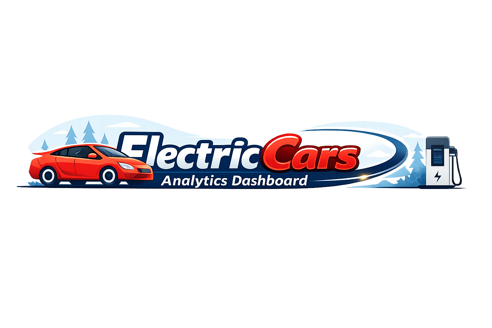
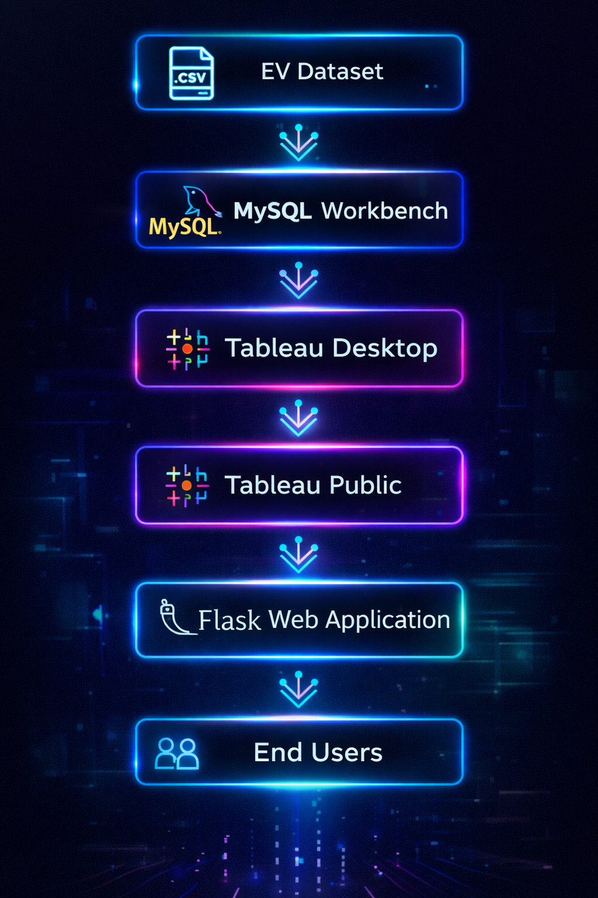

<!-- ====================== NETFLIX GOD OMEGA README ====================== -->

<p align="center">

</p>

<p align="center">

</p>

<p align="center">

</p>

<p align="center">


</p>


# 🎥 Electric Cars Analytics — Cinematic Overview

> 💎 A Netflix-style EV Analytics Platform combining **Tableau + MySQL + Flask**

Transforms EV datasets into interactive dashboards and storytelling experiences.

---


# 🧠 Senior Data Engineer Architecture

```
[ EV Dataset ]
        ↓
[ MySQL Workbench ]
        ↓
[ Tableau Desktop ]
        ↓
[ Tableau Public ]
        ↓
[ Flask Web App ]
        ↓
[ End User Experience ]
```

<p align="center">

</p>

---


# 📺 NETFLIX DASHBOARD EXPERIENCE

<iframe 
src="https://public.tableau.com/views/smartbridge_17703007375670/DashboardofElectriccarsinIndia?:embed=y&:display_count=yes&:showVizHome=no"
width="100%" height="850">
</iframe>

---

# 📖 CINEMATIC STORY EXPERIENCE

<iframe 
src="https://public.tableau.com/views/smartbridge_17703007375670/StoryofElectriccarsinIndia?:embed=y&:display_count=yes&:showVizHome=no"
width="100%" height="850">
</iframe>

---


# 🛠️ Tech Stack — Netflix Style

<p align="center">

</p>

---

# 💎 Glass Neon Feature Panels

| 🎬 Module | 🚀 Experience |
|---|---|
| 📊 Tableau Dashboard | Cinematic Analytics |
| 📖 Story Navigation | Guided Insights |
| 🌐 Flask Integration | Live Deployment |
| 🗄️ MySQL Backend | Data Connectivity |

---


# 🌐 Live Application

🚀 https://smartinternz-web-integration.onrender.com/

---

# 📂 Project Structure

```
Electric-Cars-Analytics/
│
├── flask_app/
├── dataset/
├── tableau_files/
├── assets/
│   ├── banner.png
│   └── architecture.png
└── README.md
```

---

# 🚀 Run Locally

```bash
git clone <your-repo-link>
cd Electric-Cars-Analytics
pip install flask
python app.py
```

Open:

```
http://127.0.0.1:5000
```

---

# 📈 Future Scope

- Real-time EV API Integration  
- AI Prediction Models  
- Mobile Responsive UI  
- Advanced Python Analytics  

---

# 👨‍💻 Team

**Team Leader**  
Naganaboyina Lakshmana Swamy  

**Team Members**  
Myla Venkaiah  
Sangeetham Ganesh  
Lokesh Pilla  

---

<p align="center">

</p>

<!-- ====================== END NETFLIX GOD OMEGA ====================== -->
